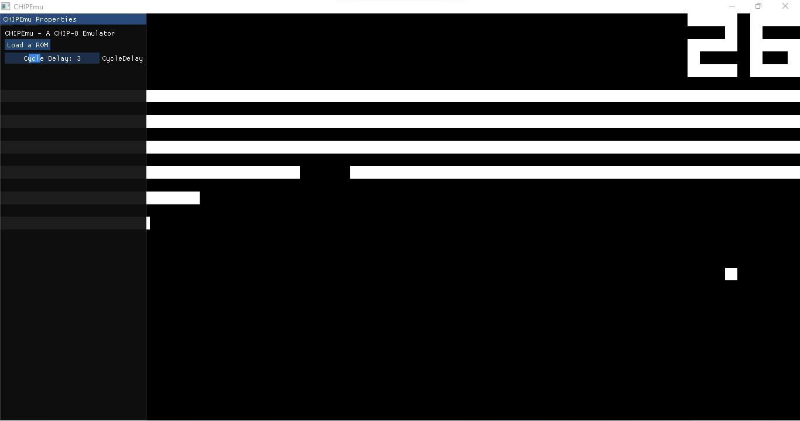

<!-- sa beyler turk war mi -->
<h1 align="center">CHIPEmu</h1>

 

### CHIPEmu, C dilinde yazdığım ve hâlâ geliştirilme aşamasında olan basit bir CHIP-8 Emülatörüdür. Video belleğini ekrana yansıtmak için OpenGL 3.3 (GLAD) ve GLFW3'ten, ses efektlerini oluşturmak için ise miniaudio kütüphanesinden yararlanır. İsteyen herkes kodu değiştirebilir ve kendi sürümünü derleyebilir. Emülasyon konusunda daha yeniyim bu yüzden emülatörde hâlâ bazı küçük sorunlar yer alıyor. İhtiyaca göre bu repositoryi güncellemeye devam edeceğim.

<h2 align="center">Nasıl Kullanılır</h2>

### CHIPEmu uygulamasını açın, klavyenizden ESC tuşuna basınca sol tarafta bir menü belirecektir. Bu menüde ROM yüklemek için bir buton ve Cycle Delay için bir kaydırıcı slider bulunur. ROMları kullanmak için arayüzle etkileşime girebilir ve Cycle Delay ayarı sayesinde oyunun hızını dilediğiniz gibi ince ayar çekerek değiştirebilirsiniz.

<h2 align="center">Nasıl Derlenir</h2>

### Normal bir kullanıcının bu adımı yapmasına gerek yoktur, ancak bu projeyi kendiniz derlemek istiyorsanız cihazınızda CMake ve GCC/G++ kurulu olmalıdır.

### Windows kullanıcıları, derleme işlemi için `CMake` ve `MinGW` kurulu olmalıdır! İlk olarak CHIPEmu proje klasörünün içinde build adında yeni bir klasör oluşturun. Komut istemini (yani CMD) bu build klasörünün içinde açın ve sadece şu komutu yazın: `CMake -G "MinGW Makefiles" ..` Eğer herhangi bir hata olmadan başarıyla tamamlanırsa, şu komutla devam edin: `CMake --build .` CHIPEmu.exe dosyanız build klasöründe hazır bir şekilde olacaktır. Artık uygulamayı çalıştırabilirsiniz.

### Linux kullanıcıları, terminalinizde `CMake`, `GCC`, `OpenGL Tools` ve `GLFW Developer Tools` kurulu olmalıdır! Bunların nasıl kurulacağını açıklamayacağım çünkü internette her yerde anlatılıyor, üşenmeden bakın lütfen, şimdi nasıl derlenir onu açıklayalım. Terminalinizi açın ve CHIPEmu proje klasörüne gidin, `mkdir build` komutuyla bir build klasörü oluşturun, ardından `cmake ..` yazın. Eğer hata almadan başarıyla tamamlanırsa şu komutla devam edin: `cmake --build .` CHIPEmu dosyanız build klasörünün içinde olacaktır. Uygulamaya yetki vermek için terminale `chmod +x CHIPEmu` yazabilir, ardından uygulamayı başlatmak için `./CHIPEmu` komutunu kullanabilirsiniz.

<h2 align="center">Eklenecekler</h2>

### Çok bir şey eksik değil ama kendim de şu temadan rahatsızım yakında belki tema falan eklerim. Duruma göre başka şeyler de ekleyeceğim ama şuanlık amacım bu kadar.